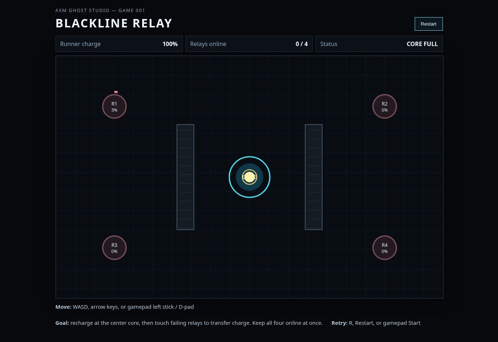
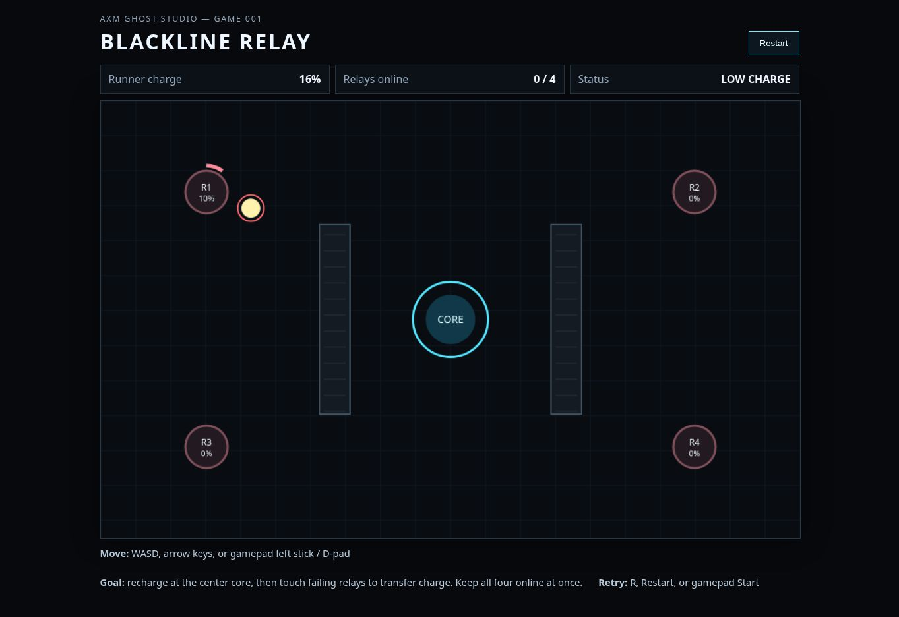
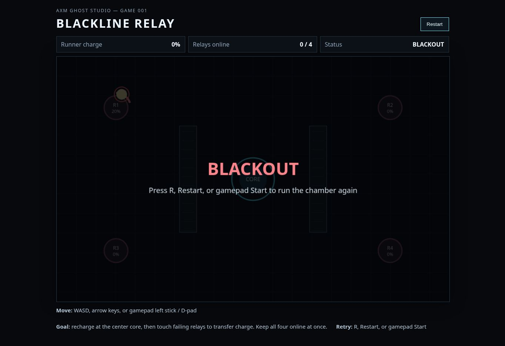
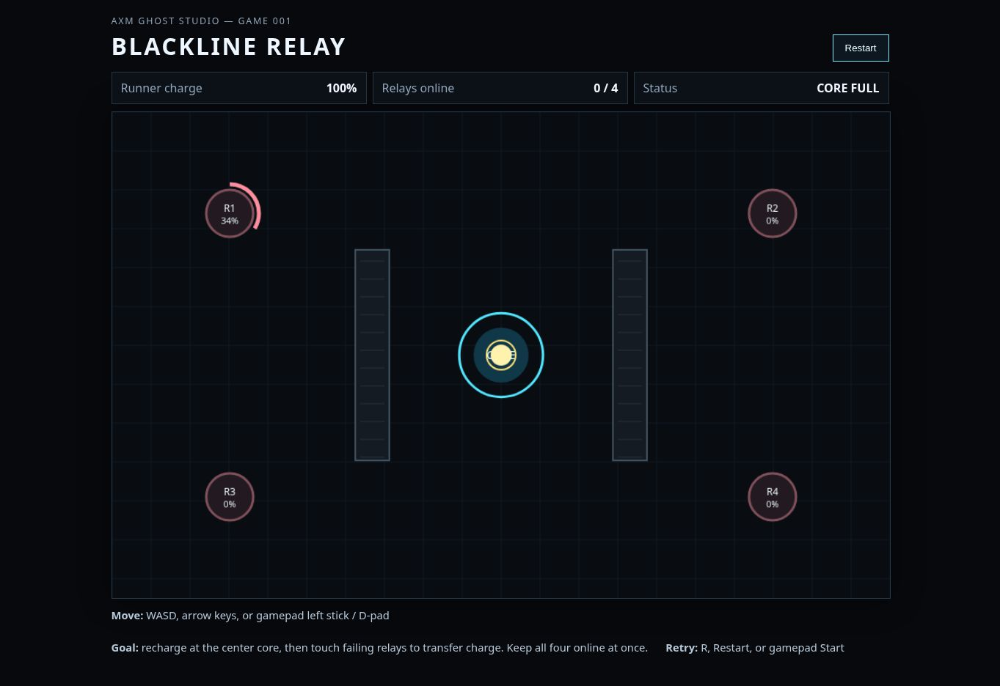

# Cloud Browser Visual Playtest — 2026-09-14

## Role and scope

External visual-evidence pass requested by Mike because the persistent Ghost Studio specialist chats did not have this live browser surface. This is evidence for the studio; it does not override Game Director, Integration, QA, or other role authority.

## Exact surface

- Repository: `mike-axiom-mir/axm-ghost-studio`
- Accepted source tested: `main` at `4af52b5ba476d2cf989c959c2c3c4d7f6f32fe88`
- Runtime anchor in repository state: `8b65e05ff53baa1a20f7ec6835906a4e44bdf2bc`
- Visual backend: cloud Chrome browser
- Load route: public `index.html` rendered through `htmlpreview.github.io` because this repository has no GitHub Pages deployment
- Game source was not changed for the test
- Input available to this surface: discrete synthetic keyboard taps; sustained human-style key holds and a physical gamepad were unavailable

## Shortest tested route

`entry -> instructions/HUD -> active movement -> upper route around bulkhead -> R1 contact/transfer evidence -> BLACKOUT -> R retry -> restored initial state`

## Observations

1. **Load/render: PASS.** The title, HUD, instructions, canvas chamber, central core, two bulkheads, four relays, runner, and Restart control rendered together without visible clipping at the tested desktop viewport.
2. **Live simulation: PASS.** R1 visibly decayed while the runner remained at the core; the semantic HUD changed with the rendered state.
3. **Movement and route collision: PASS for the bounded route observed.** Repeated ArrowUp inputs moved the runner from the core into the upper corridor. Leftward input initially met the top edge of the left bulkhead until enough upward clearance existed, then continued around it toward R1.
4. **Charge/status feedback: PASS.** Leaving the core changed status from `CORE FULL` to `ROUTING`, charge fell during travel, and `LOW CHARGE` appeared before exhaustion.
5. **Relay transfer evidence: PASS, bounded.** During the first route, R1 read 12% before final approach and 20% at BLACKOUT after contact while runner charge fell to 0%. This establishes that contact transferred some carried charge during this live browser run. It does not establish transfer balance or timing quality.
6. **Loss presentation: PASS.** BLACKOUT dimmed the chamber and presented a high-contrast central overlay naming all current retry methods.
7. **Keyboard retry: PASS.** One `R` input after BLACKOUT restored 100% runner charge, `0 / 4`, `CORE FULL`, and the initial relay seed state.
8. **Full win: NOT TESTED.** This browser-control surface sends short discrete taps rather than sustained movement. The runner therefore travels far more slowly in wall-clock time than a human holding a key, while decay and charge loss continue normally. The resulting blackout must not be interpreted as a balance defect or representative human run.

## Visual evidence

### 01 — Baseline render

The full chamber and HUD are visible. The delayed capture also records live R1 decay while idle.

### 02 — Routed around the left bulkhead, low charge

The runner is beyond the left bulkhead on the upper route; charge/status feedback is visible.

### 03 — BLACKOUT outcome

The terminal overlay and retry guidance are visible after the bounded R1 approach/contact run.

### 04 — Retry restoration

Captured immediately after the successful `R` retry; semantic checks recorded 100% charge, 0/4 online, CORE FULL, and restored relay seed state.

## Initial assessment

Blackline Relay already reads as one coherent small game rather than a loose mechanics demo. The visual hierarchy is strong: the core is unmistakable, relays and percentages are legible, the runner contrasts well, bulkheads clearly define route choice, and the status strip plus terminal overlay communicate state cleanly. The restrained cyan/pink industrial palette fits the maintenance-runner identity.

The most promising part is that the chamber geometry and decay system create a real routing problem with almost no visual clutter. The first live route immediately exposed the intended pressure: moving around a bulkhead costs time while relay urgency changes.

The main evidence gap remains exactly the repository's stated Fresh-Player Evidence Boundary. This run cannot judge normal control feel, fairness, tension, strategy comprehension, or fun because the cloud input cadence is not human-equivalent. The next useful gate is a genuine human full session at normal held-key speed, observed without coaching, rather than a new mechanic.

## Truth boundary

- **VISUALLY INSPECTED:** yes, on the exact surface above.
- **INTERACTED:** yes, through real browser keyboard events.
- **PLAYTESTED:** bounded browser-machine interaction only; not a genuine human/fresh-player playtest.
- **PHYSICAL GAMEPAD:** not tested.
- **FULL WIN:** not tested.
- **BALANCE / FAIRNESS / FUN / ACCESSIBILITY QUALITY:** unknown.
- Screenshots prove visible states only; they do not prove persistence, hardware behavior, or universal browser behavior.

## Evidence digests

- `01-baseline.jpg`: `0579f38d7b954a9a3cffc4bd8405b6522b7767607808e53b938ff3b4cf611b85`
- `02-upper-left-low-charge.jpg`: `3543984a265a10be7d08ddd58df03e497d4a7c89fa204e325672887d45da22a1`
- `03-blackout.jpg`: `a00d3496b6013dd6415d1ca85e1a30e9e15544d85c9d2d731d7e46eed91f6701`
- `04-retry.jpg`: `fdfd890a6b3faaed1665c6f92cb7fe038529fd3035a88a3cdbbb139067f3a8ee`
