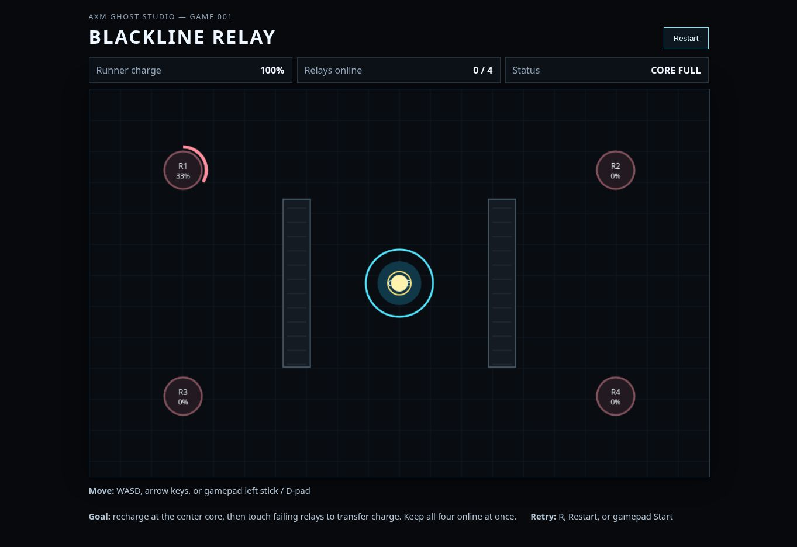
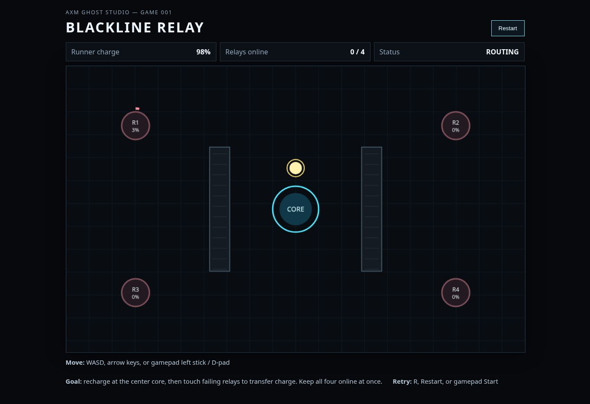

# Cloud Browser Follow-up — 2026-09-15

## Purpose

Second bounded visual/browser activation requested by Mike while the Ghost Studio specialists remained active. This extends the accepted PR #98 evidence; it does not replace or silently reinterpret that report.

## Freshness receipt

- Repository `main` observed at `18b22ee2c84016e3d5d4a6eafc76d336261ffaad` at 2026-09-15T07:28Z and rechecked at 2026-09-15T07:32Z.
- Active-build TTL used for publication: 5 minutes.
- Status at final pre-publication check: **LIVE**.
- Open overlap at capture time: draft PR #119, `Gameplay: guard startup controller swap carryover`.
- This evidence pass did not test, modify, or judge that gamepad lane.

### Later coordination freshness

After the browser capture, accepted `main` advanced to `4c1fb48cd66fb5249c7cc8ffe357ac3c3469cf84` through merged Gameplay PR #119. This report preserves the browser observation from the earlier public-`main` window around `18b22ee...`; it does **not** claim that `4c1fb48...` was freshly rendered or visually inspected by this evidence pass.

## Exact test surface and source boundary

- Visual backend: cloud Chrome.
- Load route: public repository `main/index.html` through the same browser-safe renderer used for PR #98.
- A commit-pinned renderer URL for `18b22ee...` returned a blank renderer page; that was treated as a renderer-path failure, not a game failure.
- The successful page therefore loaded the public `main` URL. Repository `main` was `18b22ee...` immediately before and after the test, and the observed post-core `99%/98%` behavior confirms that the recently accepted truthful runner-charge display was present.
- This does **not** prove every byte of the renderer response was pinned to `18b22ee...`; later gamepad/reduced-motion changes are not distinguishable through this default keyboard/no-reduced-motion surface.

## Bounded route

`load -> initial CORE FULL -> repeated ArrowUp movement -> cross core boundary -> truthful 99% then 98% ROUTING -> Restart button -> initial state -> leave core -> R restart/reset -> initial state`

## Findings

1. **Load and tested viewport composition: PASS.** Title, HUD, instructions, Restart control, canvas, core, runner, both bulkheads, and four relays were present together without reported clipping at the tested desktop viewport.
2. **Truthful near-full runner presentation: PASS.** At the core boundary the HUD changed from `100% / CORE FULL` to `99% / ROUTING`; continued movement produced `98% / ROUTING`. The full-capacity label was no longer retained after charge began draining.
3. **Live relay decay: PASS, bounded.** R1 visibly changed during the run while the other relays remained at 0%.
4. **Keyboard movement: PASS, bounded.** Repeated ArrowUp browser events moved the runner from the core to the upper field.
5. **Restart button: PASS.** Clicking Restart restored `100%`, `0 / 4`, `CORE FULL`, central runner position, and the relay seed state.
6. **R restart/reset during RUNNING: PASS.** One `R` press after leaving the core restored the same initial semantic state. This did not re-exercise terminal `WON`/`BLACKOUT` retry.
7. **Default motion path: OBSERVED ONLY.** The active browser reported `prefers-reduced-motion: reduce = false`; this run cannot add evidence for the reduced-motion path already preserved through PR #117.
8. **Gamepad startup/hot-plug/controller-swap work: NOT TESTED.** No physical or emulated standard gamepad was available. PR #119 was outside the captured route and later landed independently.
9. **Full loop/WON and fresh-player quality claims: NOT TESTED.** Discrete tap cadence remains unlike a human-held key. This follow-up intentionally targeted the newly accepted visible truth repair rather than repeating yesterday's distorted full-route attempt.

## Visual evidence

### 01 — Restored initial state

The Restart button returned the runner and HUD to the initial `100% / 0 of 4 / CORE FULL` state.

### 02 — Truthful charge after leaving the core

The runner is visibly outside the core and the HUD reports `98% / ROUTING`, preserving the distinction between near-full charge and actual full capacity.

## Assessment for the active studio

The useful sensory evidence is narrow and observable. In the tested desktop viewport, the title, three HUD status blocks, instructions, Restart control, canvas, core, runner, both bulkheads, and four relays were present together without reported clipping. During the bounded core-exit route, the visible Runner charge/status changed from actual-full `100% / CORE FULL` to sub-full `99% / ROUTING` and then `98% / ROUTING`.

The two screenshots preserve an initial/restored state and one outside-core routing state. They do **not** establish fresh-player visual hierarchy comprehension, route-choice legibility, accessibility quality, ease of parsing under live pressure, or broader visual polish. Those questions require stronger human or assistive-technology evidence than this two-state browser receipt provides.

No new visual mechanic, effect family, HUD layer, audio cue, or asset is justified by this run. A real held-key human session remains useful for comprehension/control evidence, while physical-controller and real reduced-motion-user evidence remain separate gaps.

## Truth boundary

- **VISUALLY INSPECTED:** yes by the originating browser activation; this later Experience wording repair did not re-inspect the pixels.
- **INTERACTED:** yes in the originating browser activation, using keyboard events and the Restart button.
- **EXACT REPOSITORY STATE:** repository `main` was rechecked at `18b22ee...` during capture; the renderer requested the public `main` URL rather than a byte-pinned commit because the pinned renderer route failed. Accepted `main` later advanced to `4c1fb48...`, which was not freshly rendered by this report.
- **PLAYTESTED:** NOT TESTED as a genuine human/fresh-player session. Bounded machine/browser interaction was exercised.
- **FULL WIN, BALANCE, FAIRNESS, TENSION, FUN, GAMEPAD, REDUCED-MOTION USER COMFORT, ACCESSIBILITY QUALITY:** NOT TESTED.

## Evidence digests

- `01-restart-initial.jpg`: `0d3c0657fa91d5309e606ec7a043448972b2ede4df46e061943427f56d9ca970`
- `02-truthful-charge-routing.jpg`: `a710d1d0e943d304227101c1d45ad23e462bfbb2f37b05da3e2e8dce808fef6e`

## Rollback

Evidence only. Close this proposal or revert its evidence commits; no runtime or studio-state bytes are changed.
